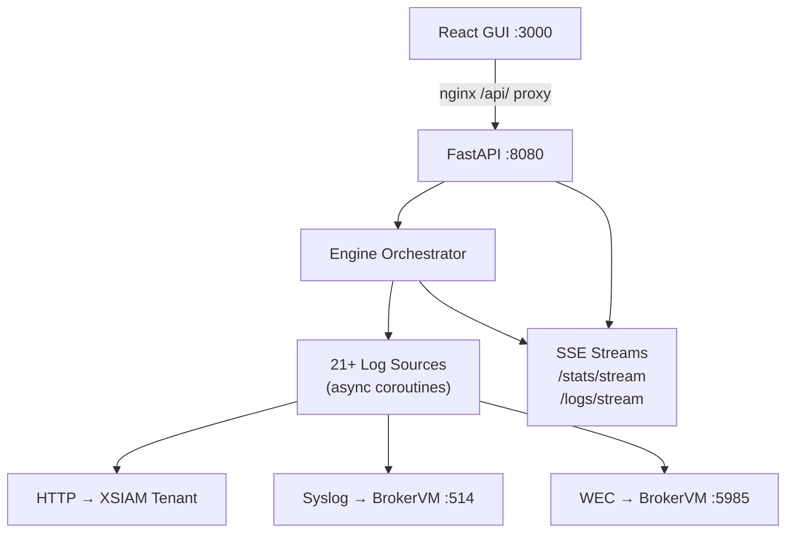

# XSIAM Log Engine

A production-quality, Dockerized enterprise log simulation engine. Generates realistic log traffic from 21+ sources and forwards it to a Palo Alto XSIAM tenant or Cortex XDR BrokerVM via HTTP, Syslog (UDP/TCP/TLS), and WEC.

## Quickstart

```bash
git clone <repo>
cd xsiam-log-engine
cp .env.example .env
# Edit .env with your XSIAM URL, API key, and BrokerVM host
docker compose up --build
```

- GUI: http://localhost:3000
- Engine API: http://localhost:8080
- API docs: http://localhost:8080/docs

## Architecture



## Log Sources

| Source | Transport | Tags |
|--------|-----------|------|
| Windows Security | WEC | windows, auth |
| Windows System | WEC | windows, system |
| Windows Application | WEC | windows, app |
| Microsoft AD | WEC | windows, identity |
| Microsoft DNS | WEC | windows, dns |
| Microsoft DHCP | WEC | windows, dhcp |
| Microsoft Defender ATP | WEC | windows, edr |
| Cisco ASA | Syslog | network, firewall |
| Cisco Meraki | Syslog | network, firewall |
| Palo Alto NGFW | Syslog | network, firewall |
| Fortinet FortiGate | Syslog | network, firewall |
| Linux Syslog | Syslog | linux, system |
| Linux Auth | Syslog | linux, auth |
| Linux Auditd | Syslog | linux, audit |
| Blue Coat Proxy | Syslog | proxy, web |
| Zscaler ZIA | Syslog | proxy, cloud |
| CrowdStrike Falcon | HTTP | edr, endpoint |
| Okta | HTTP | identity, cloud |
| Azure AD / Entra ID | HTTP | identity, cloud |
| AWS CloudTrail | HTTP | cloud, aws |
| NetFlow v5/v9 | Syslog | network, flow |

## Environment Variables

See `.env.example` for all variables. Key ones:

| Variable | Description |
|----------|-------------|
| `XSIAM_URL` | XSIAM HTTP ingest endpoint |
| `XSIAM_API_KEY` | XSIAM API key |
| `BROKERVM_HOST` | BrokerVM IP or hostname |
| `BROKERVM_SYSLOG_PORT` | Syslog port (default 514) |
| `BROKERVM_SYSLOG_PROTO` | `udp` / `tcp` / `tls` |
| `BROKERVM_WEC_PORT` | WEC port (default 5985) |
| `ENGINE_DEFAULT_EPS` | Global default events/sec |

## API Reference

| Method | Path | Description |
|--------|------|-------------|
| GET | `/api/sources` | List all sources + status |
| POST | `/api/sources/{id}/start` | Start a source |
| POST | `/api/sources/{id}/stop` | Stop a source |
| PATCH | `/api/sources/{id}/config` | Update EPS / transport |
| GET | `/api/config` | Get transport config |
| PUT | `/api/config` | Update config (live reload) |
| GET | `/api/stats` | Aggregate statistics |
| GET | `/api/stats/stream` | SSE live stats (1s) |
| GET | `/api/logs/stream` | SSE live log tail |
| POST | `/api/control/start-all` | Start all sources |
| POST | `/api/control/stop-all` | Stop all sources |
| POST | `/api/control/reload` | Reload config from disk |
| GET | `/api/health` | Transport health checks |

## Development

```bash
# Run tests
cd xsiam-log-engine
pip install -r engine/requirements.txt
pytest --cov=engine --cov-report=term-missing

# Run engine locally (no Docker)
cd engine
uvicorn api.app:app --reload --port 8080

# Run GUI locally
cd gui
npm install && npm run dev
```

## Extending

See [docs/adding_a_source.md](docs/adding_a_source.md) for the single-file plugin guide.

## BrokerVM Setup

See [docs/brokervm_setup.md](docs/brokervm_setup.md) for port requirements and configuration.
