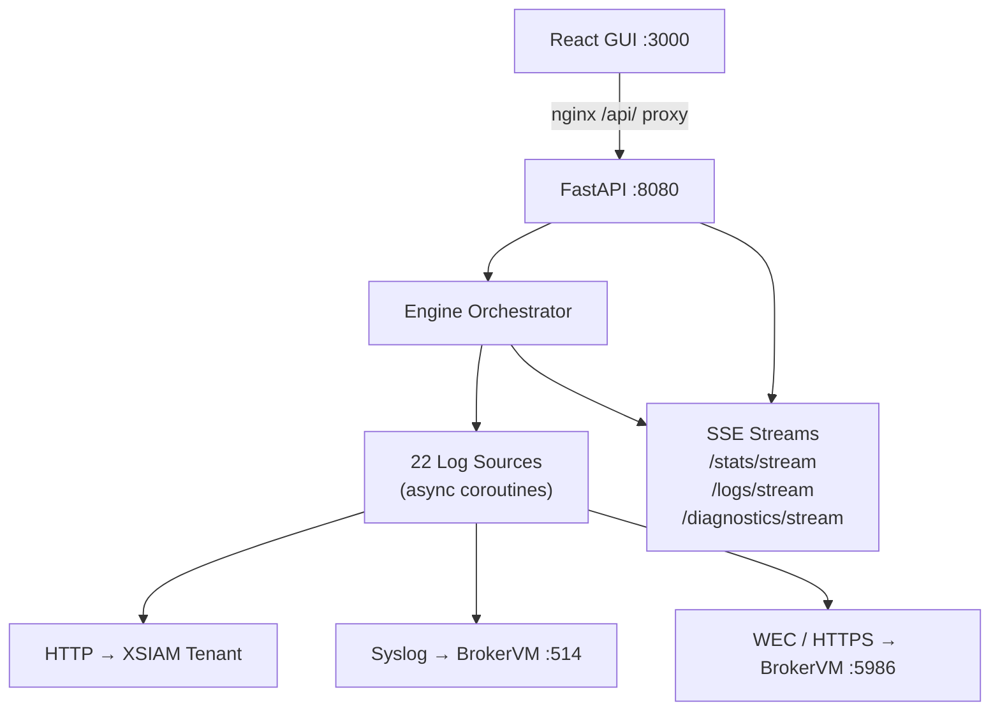

# XSIAM Log Engine

A Dockerized enterprise log-simulation engine. It generates realistic log traffic from **22 enterprise sources** and forwards it to a Palo Alto **Cortex XSIAM** tenant or **Cortex XDR BrokerVM** over three transports — HTTP (XSIAM HTTP Collector), Syslog (UDP/TCP/TLS), and WEC (Windows Event Forwarding over HTTPS).

Use it to exercise XSIAM/XDR ingestion, validate parsing rules, demo dashboards, or load-test a BrokerVM — without touching real endpoints.

- **React GUI** with live dashboard, per-source controls, log viewer, and diagnostics
- **Async engine** with per-source rate limiting (events/sec), live config reload, and a circuit breaker
- **Realistic generators** — vendor-accurate fields, Windows event schemas, CEF/LEEF/syslog framing, JSON EDR/identity/cloud events

---

## Contents

- [Quickstart](#quickstart)
- [How it works](#how-it-works)
- [Log sources](#log-sources)
- [Transports](#transports)
- [Configuration](#configuration)
- [WEC setup](#wec-setup)
- [XSIAM parsing rules](#xsiam-parsing-rules)
- [GUI](#gui)
- [API reference](#api-reference)
- [Security](#security)
- [Development](#development)
- [Project layout](#project-layout)

---

## Quickstart

```bash
git clone <repo>
cd xsiam-log-engine
cp .env.example .env
#   edit .env  →  XSIAM_URL, XSIAM_API_KEY, BROKERVM_HOST
docker compose up --build
```

| Service | URL | Notes |
|---------|-----|-------|
| GUI | http://localhost:3000 | nginx serving the React build + `/api/` proxy |
| Engine API | http://127.0.0.1:8080 | bound to loopback; reach it through the GUI in normal use |
| OpenAPI docs | http://127.0.0.1:8080/docs | engine direct port only |

You can also configure everything from the GUI after first boot — open **Configuration**, fill in the XSIAM URL, API key, and BrokerVM host, and click save. Changes are written to `.env` and hot-reloaded; no restart needed. A first-run banner on the Dashboard links you there if credentials are still unset.

---

## How it works



Each source runs as its own asyncio coroutine driven by a token-bucket rate limiter, so you can dial events/sec independently per source (live, from the GUI). A generated event is framed for its transport and sent; results feed a rolling stats window and a ring-buffer log tail that the GUI streams over Server-Sent Events.

If a source hits **5 consecutive send errors** it trips a circuit breaker and auto-disables, surfacing a red "Tripped" badge on its card and a Dashboard banner — so a misconfigured transport fails loudly instead of silently burning cycles.

---

## Log sources

| Source | Transport | Tags |
|--------|-----------|------|
| Windows Security | WEC | windows, auth |
| Windows System | WEC | windows, system |
| Windows Application | WEC | windows, app |
| Microsoft AD | WEC | windows, identity |
| Microsoft DNS | WEC | windows, dns |
| Microsoft DHCP | WEC | windows, dhcp |
| Microsoft Defender ATP | WEC | windows, edr |
| Cisco ASA | Syslog | network, firewall |
| Cisco Meraki | Syslog | network, firewall |
| Palo Alto NGFW | Syslog | network, firewall |
| Fortinet FortiGate | Syslog | network, firewall |
| Linux Syslog | Syslog | linux, system |
| Linux Auth | Syslog | linux, auth |
| Linux Auditd | Syslog | linux, audit |
| Blue Coat Proxy | Syslog | proxy, web |
| Zscaler ZIA | Syslog | proxy, cloud |
| CrowdStrike Falcon | HTTP | edr, endpoint |
| Okta | HTTP | identity, cloud |
| Azure AD / Entra ID | HTTP | identity, cloud |
| AWS CloudTrail | HTTP | cloud, aws |
| NetFlow v5/v9 | Syslog | network, flow |
| Proofpoint TAP | HTTP | email, cloud |

A source's transport isn't fixed — any source advertising multiple `supported_transports` can be switched from its card in the GUI. See [docs/adding_a_source.md](docs/adding_a_source.md) to add your own in a single file (auto-discovered at startup).

---

## Transports

| Transport | Target | Framing | Auth |
|-----------|--------|---------|------|
| **HTTP** | XSIAM HTTP Collector (`/logs/v1/event`) | JSON / raw / CEF / LEEF, optional gzip | `Authorization: <api_key>` |
| **Syslog** | BrokerVM `:514` | RFC 5424 (auto), or pre-framed RFC 3164/5424/audit/Meraki/NetFlow passthrough; UDP, TCP (octet-counted), or TLS | TLS client cert (optional) |
| **WEC** | BrokerVM `:5986` | WS-Management SOAP envelope wrapping a Windows `<Event>` | TLS client cert (mutual TLS) |

HTTP log type and compression are configurable per source from the GUI. Syslog picks RFC 5424 framing automatically unless a source emits a pre-framed line (e.g. Cisco/Meraki/NetFlow), which is passed through untouched with per-source facility/severity.

---

## Configuration

All settings load from `.env` (see [`.env.example`](.env.example)). They can also be edited live in the GUI **Configuration** page, which persists them back to `.env` and hot-reloads the transports.

| Variable | Description | Default |
|----------|-------------|---------|
| `XSIAM_URL` | XSIAM HTTP ingest endpoint (`https://api-<tenant>/logs/v1/event`) | — |
| `XSIAM_API_KEY` | XSIAM API key (sent verbatim as `Authorization`) | `changeme` |
| `XSIAM_DATASET` | Default dataset name | `xsiam_log_engine` |
| `BROKERVM_HOST` | BrokerVM IP or hostname | `127.0.0.1` |
| `BROKERVM_SYSLOG_PORT` | Syslog port | `514` |
| `BROKERVM_SYSLOG_PROTO` | `udp` / `tcp` / `tls` | `udp` |
| `BROKERVM_WEC_PORT` | Fallback WEC port when no subscription URL is set | `5986` |
| `WEC_SUBSCRIPTION_URL` | Full WEF subscription manager string (sets WEC host + port) | — |
| `TLS_CLIENT_CERT_PATH` | WEC/syslog client cert — set automatically by `.pfx` upload | — |
| `TLS_CLIENT_KEY_PATH` | WEC/syslog client key — set automatically by `.pfx` upload | — |
| `ENGINE_API_PORT` | Engine listen port | `8080` |
| `ENGINE_DEFAULT_EPS` | Global default events/sec for new sources | `10` |
| `ENGINE_LOG_LEVEL` | `DEBUG` / `INFO` / `WARNING` / `ERROR` | `INFO` |
| `ENGINE_API_TOKEN` | Optional token required on every `/api/*` request | _(disabled)_ |
| `XSIAM_API_URL` | XSIAM public (management) API base for correlation rules (`https://api-<tenant>`, no path) | — |
| `XSIAM_API_KEY_ID` | API key ID (sent as `x-xdr-auth-id`) | — |
| `XSIAM_API_SECRET` | API key value (sent as `Authorization`) — needs a **standard** key with Instance Administrator role | — |

---

## WEC setup

Set `WEC_SUBSCRIPTION_URL` to the Windows Event Forwarding subscription string copied from your BrokerVM:

```
WEC_SUBSCRIPTION_URL=Server=HTTPS://bvm.lab:5986/wsman/SubscriptionManager/WEC,Refresh=600,IssuerCA=37210BA1582B95CB0CB558C572B503C349692604
```

The engine parses the `Server=` component for the WEC host and port. The `IssuerCA` thumbprint is kept for reference / Group Policy. Authentication is **mutual TLS**: upload your BrokerVM-issued `.pfx` (PKCS#12) under **Configuration → WEC Client Certificate**. The upload uses `openssl` (with a `-legacy` fallback) so older Windows-generated PKCS#12 files using RC2/3DES ciphers parse correctly. See [docs/brokervm_setup.md](docs/brokervm_setup.md) for BrokerVM port and listener configuration.

---

## XSIAM parsing rules

Every HTTP event carries a `simulated_log_source` field so you can route each source to its own dataset:

- **JSON** logs — injected as a field: `{"simulated_log_source": "crowdstrike_falcon", ...}`
- **Raw / CEF / LEEF** logs — prefixed as a key/value: `simulated_log_source="crowdstrike_falcon" <log line>`

> The engine auto-detects a JSON body and injects the field *inside* the object rather than prefixing it — XSIAM rejects a key/value prefix in front of a JSON payload, so this keeps the body valid.

Expand a source's **HTTP settings** on its card to copy a ready-made ingest rule:

```
[INGEST:vendor="log", product="sim", target_dataset="log_sim_raw", no_hit=drop]filter simulated_log_source = "crowdstrike_falcon";
```

Add it under **Settings → XDR Data Management → Parsers → New Parser** in your XSIAM tenant.

### Cribl Stream emulation

Per source, opt-in, HTTP transport only (toggle in **HTTP settings** on the source card). Stamps events with Cribl Stream-style metadata — `cribl_pipe`, `cribl_host`, `cribl_breaker`, `_time`, `source`, `sourcetype` — as if the event had been routed through a Cribl worker before reaching XSIAM, without an actual Cribl instance anywhere. Off by default; off is a no-op (byte-identical output to a source with the toggle never touched).

---

## Attack scenarios

Timed, correlated event sequences across sources — a single resolved identity/host/IP fires a
realistic multi-vendor story, so a correlation rule has something real to detect instead of
unrelated per-source noise. Two are shipped (`engine/scenarios/definitions/*.yaml`):

- **Phishing to Exfiltration** — Proofpoint click → Okta SSO sign-in → CrowdStrike detection → AWS CloudTrail `GetObject`.
- **Insider Privilege Escalation** — Okta password change → AWS `CreateAccessKey`/`AttachUserPolicy` → CrowdStrike process activity.

Four sources (`okta`, `crowdstrike_falcon`, `aws_cloudtrail`, `proofpoint_tap`) accept a shared
`ScenarioEntities` (username/domain user/host/internal+external IP) and per-step `overrides`
(e.g. force a specific `event_type`); every other source safely no-ops back to its normal
`generate()` if ever referenced in a scenario step. Runs execute as background asyncio tasks with
per-step delay + jitter timed from scenario start, independent of whether a source's own EPS loop
is running, and share the same transport/stats/log-ring path as normal traffic. Add a scenario by
dropping a new YAML file in `engine/scenarios/definitions/` — no code changes required unless it
needs a source that doesn't yet accept entity overrides.

---

## GUI

- **Dashboard** — live aggregate stats (EPS, sent, errors, per-transport counts), transport health, Start/Stop All (Stop All is two-click to confirm), and first-run / circuit-breaker banners.
- **Sources** — searchable, tag-filterable grid. Per card: enable toggle, log-scale EPS slider with numeric entry, transport selector, HTTP log-type/compression/API-key, and the copyable parsing rule.
- **Correlation Rules** — engine-managed XSIAM correlation rules (`[LogSim]` prefix): tenant state, per-row remove, Remove All. Rules are pushed/removed per source from its card; the backend always lists tenant rules first, so an existing rule is never silently overwritten (explicit overwrite confirm) and removals of absent rules fail cleanly.
- **Scenarios** — run a shipped attack scenario, watch each step transition pending → fired/error in real time, and cancel an in-flight run.
- **Configuration** — XSIAM + BrokerVM settings, the XSIAM Public API credentials (with a staged **Test connection** probe), and the `.pfx` upload.
- **Log Viewer** — live SSE tail with pause (buffers while paused), text search, success/error filter, raw/pretty toggle, and NDJSON download.
- **Diagnostics** — engine log stream with Off / Errors / Informational levels; shows outgoing request previews and full transport error responses.

**Themes** — five built-in themes selectable from the sidebar: **Light**, **Dark**, **Midnight Cyan**, **Nord**, and **Solarized Dark**. The choice is remembered and applied before first paint (no flash). All four dark variants are first-class; status and per-transport colors stay constant across themes since they encode meaning.

---

## API reference

All routes are under `/api`. When `ENGINE_API_TOKEN` is set, send it as the `X-Engine-Token` header (or `?token=` for SSE streams).

| Method | Path | Description |
|--------|------|-------------|
| GET | `/api/sources` | List all sources + status |
| GET | `/api/sources/{id}` | Single source detail |
| POST | `/api/sources/{id}/start` | Start a source |
| POST | `/api/sources/{id}/stop` | Stop a source |
| PATCH | `/api/sources/{id}/config` | Update EPS / transport / HTTP settings |
| GET | `/api/config` | Get transport config (API key masked) |
| PUT | `/api/config` | Update config (persists to `.env`, live reload) |
| POST | `/api/config/validate` | Staged probe of the XSIAM Public API settings |
| GET | `/api/correlations` | List engine-managed correlation rules on the tenant (`?all=true` for every rule) |
| GET | `/api/correlations/{id}/preview` | Generated rule for a source (local, no tenant call) |
| POST | `/api/correlations/{id}` | Push a source's rule (list-first; 409 unless `?overwrite=true`) |
| DELETE | `/api/correlations/{id}` | Remove a source's rule (404 if absent on tenant) |
| DELETE | `/api/correlations` | Remove all engine-managed (`[LogSim]`) rules |
| GET | `/api/scenarios` | List available attack scenarios |
| GET | `/api/scenarios/runs` | List scenario run history (bounded, newest first) |
| GET | `/api/scenarios/runs/{run_id}` | Single run detail (per-step status) |
| POST | `/api/scenarios/{id}/run` | Start a scenario run |
| POST | `/api/scenarios/runs/{run_id}/cancel` | Cancel an in-flight run |
| POST | `/api/certs/pfx` | Upload WEC client certificate (`.pfx` / PKCS#12) |
| GET | `/api/stats` | Aggregate statistics |
| GET | `/api/stats/sources` | Per-source statistics |
| GET | `/api/stats/stream` | SSE live stats (1 s) |
| GET | `/api/logs/stream` | SSE live log tail (optional `?source_id=`) |
| GET | `/api/diagnostics/logs` | Recent diagnostic entries |
| GET / PUT | `/api/diagnostics/level` | Get / set diagnostics level (`off`/`errors`/`info`) |
| DELETE | `/api/diagnostics/logs` | Clear the diagnostics buffer |
| GET | `/api/diagnostics/stream` | SSE live diagnostics |
| POST | `/api/control/start-all` | Start all sources |
| POST | `/api/control/stop-all` | Stop all sources |
| POST | `/api/control/reload` | Reload config from disk |
| GET | `/api/health` | Per-transport health checks |

---

## Security

This is a lab/testing tool; defaults assume it runs on a trusted network. Current posture:

- **Same-origin only** — no CORS middleware; the GUI reaches the API through the nginx (`/api/`) proxy. The engine port is published on `127.0.0.1` by Compose.
- **Optional token auth** — set `ENGINE_API_TOKEN` to require a constant-time-compared token on every `/api/*` request (header, or `?token=` for SSE) — and on `/docs`, `/redoc`, and `/openapi.json`, which otherwise expose the full route/schema surface regardless of the token.
- **Hardened container** — engine runs non-root with Compose resource limits; `.env` is excluded from images via `.dockerignore`.
- **nginx headers** — `X-Frame-Options: DENY`, `X-Content-Type-Options: nosniff`, `Referrer-Policy: no-referrer`, and a restrictive `Content-Security-Policy`.
- **Secrets** — the API key is masked on `GET /api/config` and never logged; request/response previews in diagnostics exclude auth headers.
- **WEC certificate handling** — the `.pfx` upload is capped at 256 KiB (checked against bytes actually read, not the declared `Content-Length`); the extracted key, cert, and the `certs/` directory itself are written `0600`/`0700`; and the openssl passphrase is passed over the child process's stdin (`-passin fd:0`), never as a `pass:...` argv value another local user could read off `ps`.

---

## Development

```bash
# Tests (103 passing: sources, transports HTTP/Syslog/WEC, API)
pip install -r engine/requirements.txt
pytest tests/ -q
pytest tests/ --cov=engine --cov-report=term-missing   # with coverage

# Engine locally (no Docker)
cd engine && uvicorn api.app:app --reload --port 8080

# GUI locally (Vite dev server, proxies /api to the engine)
cd gui && npm install && npm run dev
```

---

## Project layout

```
engine/
  api/            FastAPI app, routers (sources, config, stats, control, diagnostics, certs), models
  sources/        one file per log source (auto-discovered)
  transports/     http, syslog, wec
  xsiam_api/      XSIAM public-API client + rule generation (correlation rules)
  scenarios/      correlated multi-source attack scenarios (loader, runner, definitions/*.yaml)
  config/         settings (pydantic-settings), defaults.yaml
  utils/          rate limiter, diagnostics buffer, faker helpers, logger
gui/
  src/
    pages/        Dashboard, Sources, Configuration, LogViewer, Diagnostics
    components/   SourceCard, StatsBar, LogViewer, Toast, ThemeToggle, …
    hooks/        useSSE, useToast
    theme.ts      5-theme palette definitions + applyTheme()
tests/            sources, transports, API
docs/             adding_a_source.md, architecture.md, brokervm_setup.md
```

## Extending

- **Add a source** — [docs/adding_a_source.md](docs/adding_a_source.md) (single-file plugin guide)
- **Architecture deep-dive** — [docs/architecture.md](docs/architecture.md)
- **BrokerVM setup** — [docs/brokervm_setup.md](docs/brokervm_setup.md)
