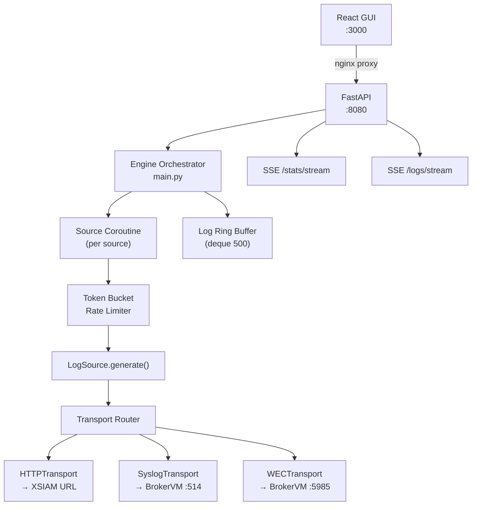

# Architecture

## Design Decisions

### Plugin Registry Pattern
Sources are auto-discovered at startup via `pkgutil.iter_modules` + `inspect.getmembers`. Adding a new source requires only creating a file in `engine/sources/` that subclasses `LogSource` — no other files need modification.

### Async-First
The entire engine is `asyncio`-based. Each source runs as an independent coroutine (`asyncio.Task`) controlled by an `asyncio.Event`. The token bucket rate limiter uses `asyncio.Lock` and `asyncio.sleep` exclusively.

### Transport Isolation
Transport failures (connection refused, HTTP 5xx, TLS errors) are caught at the source-loop level and increment `total_errors` without crashing the engine. Each transport reconnects lazily on the next send attempt.

### Live Config Reload
`PUT /api/config` mutates the `settings` singleton and nullifies transport connection handles, forcing reconnect on the next send. No restart required.

### Stats Ring Buffer
A `collections.deque(maxlen=500)` holds recent log entries for the SSE `/api/logs/stream` endpoint. Stats are computed from per-source counters on every read.

## Architecture Diagram

## Data Flow

1. GUI toggles a source → `POST /api/sources/{id}/start`
2. Engine spawns `asyncio.Task` for that source
3. Task loops: `await bucket.acquire()` → `await source.generate()` → `await transport.send()`
4. Send result updates per-source counters
5. Raw log snippet appended to ring buffer
6. SSE clients receive stats + log updates at 1s / 0.5s intervals

## Transport Protocols

| Protocol | Implementation | Framing |
|----------|---------------|---------|
| HTTP | `httpx.AsyncClient` + HMAC-SHA256 | JSON array batches |
| Syslog UDP | `asyncio.DatagramTransport` | RFC 5424 |
| Syslog TCP/TLS | `asyncio.StreamWriter` | RFC 5424 + octet-count |
| WEC | `httpx.AsyncClient` | WS-Management SOAP envelope |

## Configuration Persistence

Source enable/disable and EPS state are persisted to the `engine-config` Docker volume via `defaults.yaml`. The volume survives `docker compose down && docker compose up`.
