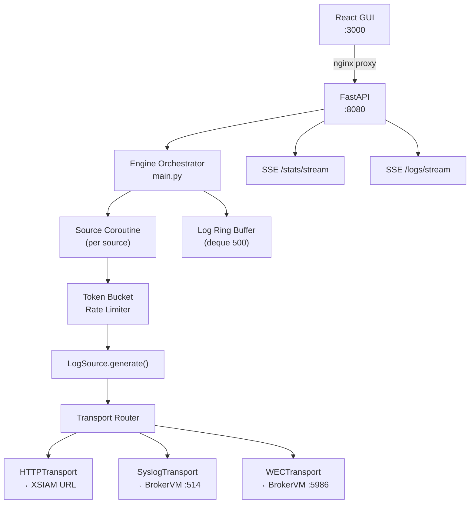

# Architecture

## Design Decisions

### Plugin Registry Pattern
Sources are auto-discovered at startup via `pkgutil.iter_modules` + `inspect.getmembers`. Adding a new source requires only creating a file in `engine/sources/` that subclasses `LogSource` — no other files need modification.

### Async-First
The entire engine is `asyncio`-based. Each source runs as an independent coroutine (`asyncio.Task`) controlled by an `asyncio.Event`. The token bucket rate limiter uses `asyncio.Lock` and `asyncio.sleep` exclusively.

### Transport Isolation
Transport failures (connection refused, HTTP 5xx, TLS errors) are caught at the source-loop level and increment `total_errors` without crashing the engine. Each transport reconnects lazily on the next send attempt.

### Live Config Reload
`PUT /api/config` mutates the `settings` singleton and nullifies transport connection handles, forcing reconnect on the next send. No restart required.

### Stats Ring Buffer
A `collections.deque(maxlen=500)` holds recent log entries for the SSE `/api/logs/stream` endpoint. Stats are computed from per-source counters on every read.

### Scenario Runner
`ScenarioRunner` (`engine/scenarios/runner.py`) fires timed, entity-correlated event sequences across sources, independent of each source's own steady-state EPS loop. A run is a background `asyncio.Task` per scenario, stepping through `delay`/`jitter`-timed calls to `Engine.fire_scenario_event()` — the same send-and-record path normal traffic uses, so scenario events appear in stats/log-ring/dashboards identically to anything else. Scenario definitions are YAML files under `engine/scenarios/definitions/`, loaded once at startup by `scenarios/loader.py`.

### Correlation Rules Client
`engine/xsiam_api/` holds a small client for the *XSIAM Public (management) API* — a different host/credential pair than the log-ingest collector (`XSIAM_API_URL`/`XSIAM_API_KEY_ID`/`XSIAM_API_SECRET`, vs. `XSIAM_URL`/`XSIAM_API_KEY`). It generates and pushes `[LogSim]`-prefixed correlation rules per source so a tenant has something to detect the simulated traffic with, without ever mutating a rule it didn't create.

## Architecture Diagram

```mermaid
graph TB
    GUI["React GUI\n:3000"] -->|nginx proxy| API["FastAPI\n:8080"]
    API --> Engine["Engine Orchestrator\nmain.py"]
    Engine --> S1["Source Coroutine\n(per source)"]
    S1 --> TB["Token Bucket\nRate Limiter"]
    TB --> GEN["LogSource.generate()"]
    GEN --> XPORT["Transport Router"]
    XPORT --> HTTP["HTTPTransport\n→ XSIAM URL"]
    XPORT --> SYSLOG["SyslogTransport\n→ BrokerVM :514"]
    XPORT --> WEC["WECTransport\n→ BrokerVM :5986"]
    Engine --> RING["Log Ring Buffer\n(deque 500)"]
    API --> SSE1["SSE /stats/stream"]
    API --> SSE2["SSE /logs/stream"]
```

## Data Flow

1. GUI toggles a source → `POST /api/sources/{id}/start`
2. Engine spawns `asyncio.Task` for that source
3. Task loops: `await bucket.acquire()` → `await source.generate()` → `await transport.send()`
4. Send result updates per-source counters
5. Raw log snippet appended to ring buffer
6. SSE clients receive stats + log updates at 1s / 0.5s intervals

## Transport Protocols

| Protocol | Implementation | Framing |
|----------|---------------|---------|
| HTTP | `httpx.AsyncClient`, `Authorization: <api_key>` header | one event per POST (JSON/raw/CEF/LEEF, optional gzip) |
| Syslog UDP | `asyncio.DatagramTransport` | RFC 5424 |
| Syslog TCP/TLS | `asyncio.StreamWriter` | RFC 5424 + octet-count |
| WEC | `httpx.AsyncClient`, mutual TLS | WS-Management SOAP envelope |

The XSIAM *Public API* client (`engine/xsiam_api/client.py`, used only for correlation-rule management, not log ingest) uses a separate scheme: `Authorization: <api_secret>` + `x-xdr-auth-id: <api_key_id>`. No HMAC signing is used anywhere in this codebase.

## Configuration Persistence

Source enable/disable and EPS state are persisted to the `engine-config` Docker volume via `defaults.yaml`. The volume survives `docker compose down && docker compose up`.
